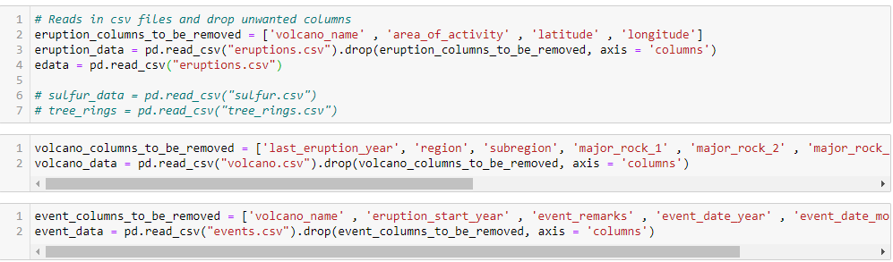
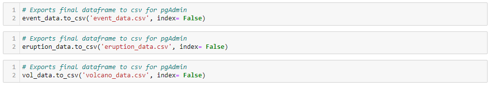
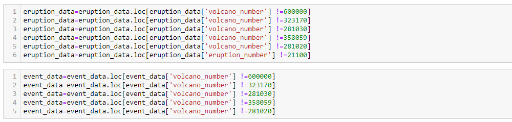

# Project 2:Volcanoes

### Group Members
---
#### Sharath
#### Briana
#### Henry
#### Julie
 
  
   

### Visuals:
---
- World map- all volcanoes overlay-eruptions within 200 years
- Bar graph- top 10 eruptions by size (interact by continent? Type?)
- Histogram- largest eruption by year
- Line graph- of most eruptions by year

- #### Bonus options:
  - ##### World map- eruptions by year
  - ##### Marker Cluster map
  - ##### Pie chart - underwater/on land

### Tasks-
---
- Develop sql database, volcanoes as keys
- develop Flask app
- build website with HMTL/bootstrap
- integrate website with Flask
- Leaflet for maps
- Plotly for the graphs

### Data Cleaning
---
First a source was located on [Kaggle](https://www.kaggle.com/) for a collection of data concerning volcanic eruptions.

We then created a database map using [GenMyModel](https://www.genmymodel.com/) to determine what data cleaning would be neccesary.

Using a Jupyter Notebook the CSV files were imported into Dataframes which excluded the columns containing data that would not be used in the final database.

These Dataframes were then exported as CSV files for loading into a SQL database.

While importing the resutling CSV files into the database tables a major issue became known. The Eruptions data which had foreign keys connected to the Volcano data contained keys that were not present in the Volcano Data. Originally the missing data was added to the Dataframe manually from the original source provided in the Kaggle documentation. However after a significant number of missing Volcanoes were discovered code as added to the Notebook to determine the scope of this issue. Exploratory methods were used to determine how many Volcano Numbers were present in the Eruption data and not the Volcano Data. The difference was determined to be in excess of 200 entries. Due to this extreme difference it was necessary to locate a similar dataset. Using the original source provided by the Kaggle documentation we were able to obtain a database of volcanoes that was in an Excel format. This necessitated data cleaning inside of Excel which involved removing extranious header rows and reordering columns, the prepared Excel file was then exported as a CSV. The resulting CSV file was then uploaded into the Jupyter Notebook and run through the same exploratory methods, and it was determined that the differences had been reduced to 5. These differences were manually determined to not be significant to the final project and were removed.

To run this application, first create and activate an environment with the necessary packages by running the following lines in your command line or terminal:

$ conda create --name volReqs.txt --file spec-file.txt

$ conda activate volEnv

### Map Plot
---
* The plot for mapping the eruptions was made using the Mapbox API
* Created a congig.js file to store the API key
* An API key will be needed to use the Mapbox API
* Plots were taken from a json server and stored into an 
* Each eruption from the json file was used to plot points
* The array was used to make points on the map by using the latitude and longitude
* Each point also included the volcano name and desciption

To create a Mapbox API key, sign into [Mapbox](https://www.mapbox.com/) and clock the [Sign up](https://account.mapbox.com/auth/signup/) button on the top left of the screen.
